# Property Management (Aplikasi Kos-Kosan)

## About 📖

Kos Pangeran is full management tool to help homeowner to manage their property like house-rental, apartment, or boarding house. Designed to be simple and easy to use, Kos Pangeran is a perfect solution for those who want to manage their property without any hassle.

## Features 🚀

-   Manage building area
-   Manage room & room type
-   Manage member
-   Record member payment / transaction
-   Record room maintenance history
-   Create invoice for monthly or yearly
-   Multiple account for payment
-   Export payment history to excel & pdf

See the [screenshot](#screenshot-) below for more detail.

## Built with 🛠️

-   Laravel 11
-   Docker
-   MongoDB
-   Bootstrap 5
-   DataTables

## Installation 🖥️

1. Clone this repository

```bash
git clone https://github.com/iniakunhuda/kospangeran
```

2. Install dependencies

```bash
composer install
```

3. Copy `.env.example` to `.env`

```bash
cp .env.example .env
```

4. Generate application key

```bash
php artisan key:generate
```

5. Run docker

```bash
docker-compose up -d
```

6. Run migration

```bash
php artisan migrate
```

7. Run seeder

```bash
php artisan db:seed
```

8. Open the application in browser

```bash
http://localhost:8000
```

## License

This project is open-sourced software licensed under the [MIT license](https://opensource.org/licenses/MIT).

## Contact

If you have any question or want to contribute, feel free to contact me:

-   Email: [iniakunhuda@gmail.com](mailto:iniakunhuda@gmail.com)
-   LinkedIn: [https://www.linkedin.com/in/iniakunhuda/](https://www.linkedin.com/in/iniakunhuda/)

<br><br>

# Screenshot 📸

### **Manage building area**

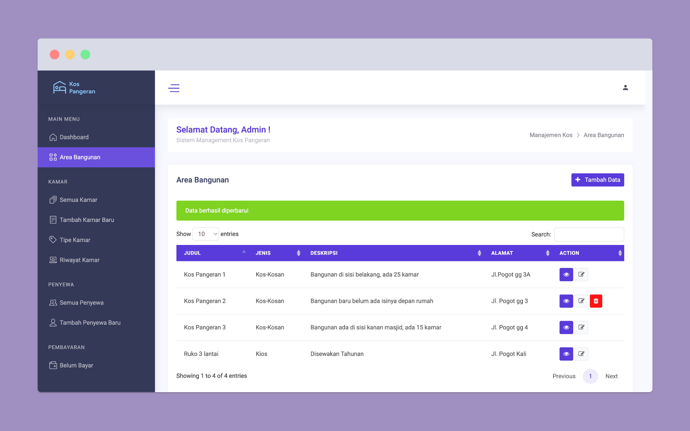
<em>Create, edit, delete area</em>

### **Manage room**

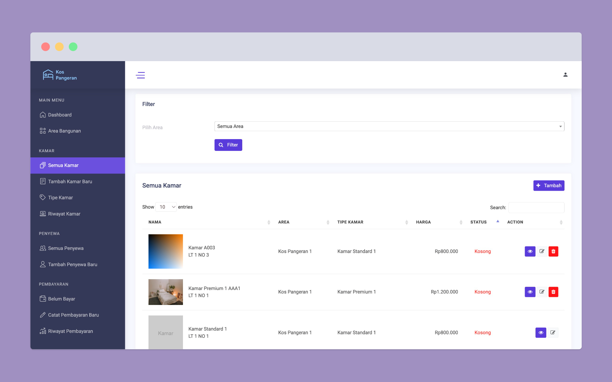
<em>Create, edit, delete room</em>

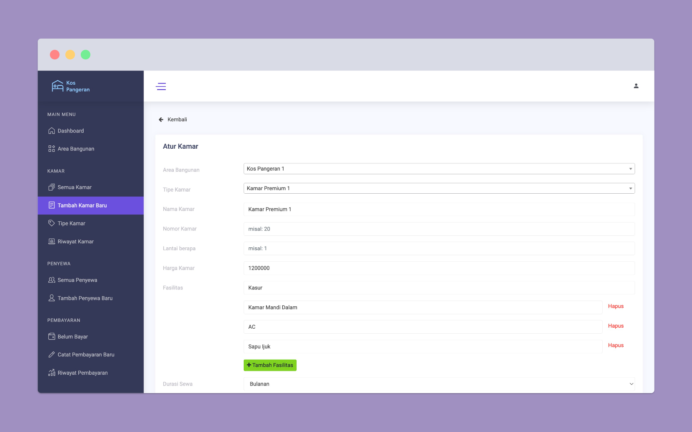
<em>Form create room</em>

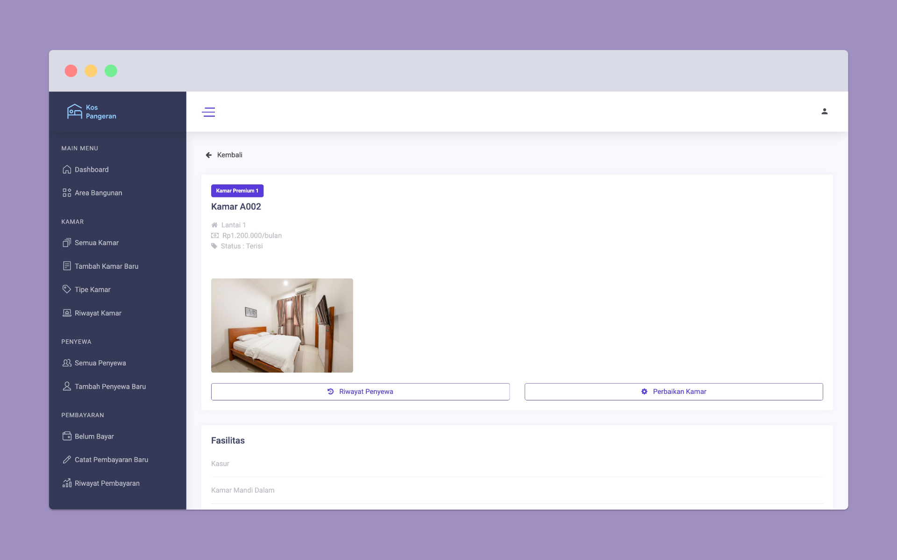
<em>Detail room information</em>

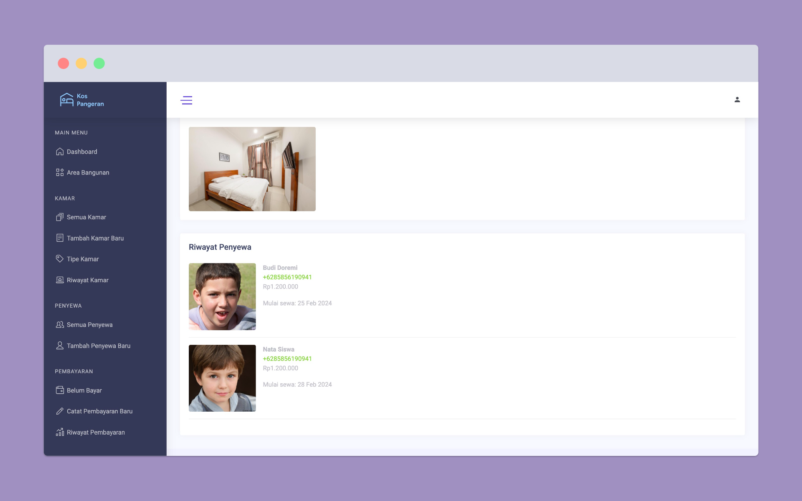
<em>Detail room information - history member</em>

### **Manage room type**

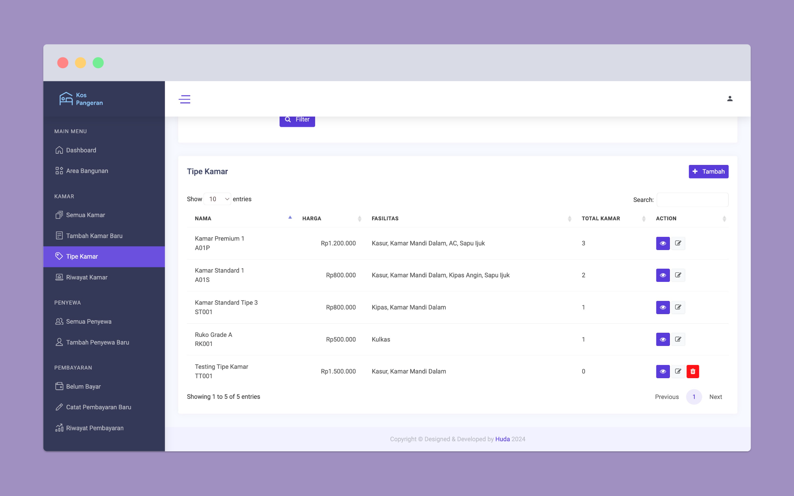
<em>Create, edit, delete room type</em>

### **Manage member**

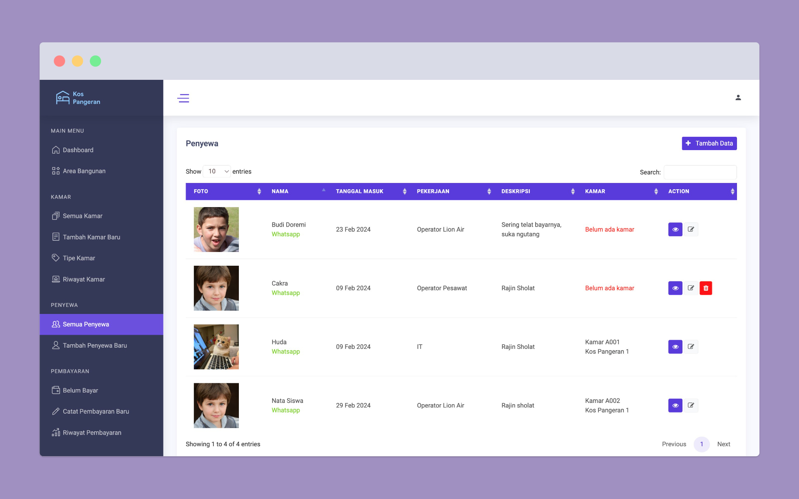
<em>Create, edit, delete member</em>

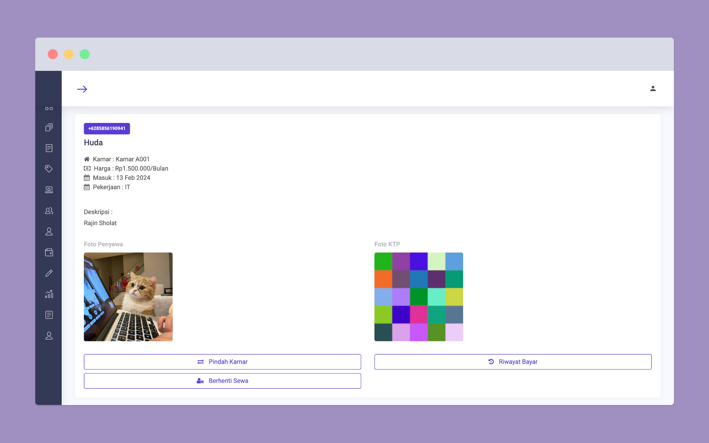
<em>Detail member information</em>

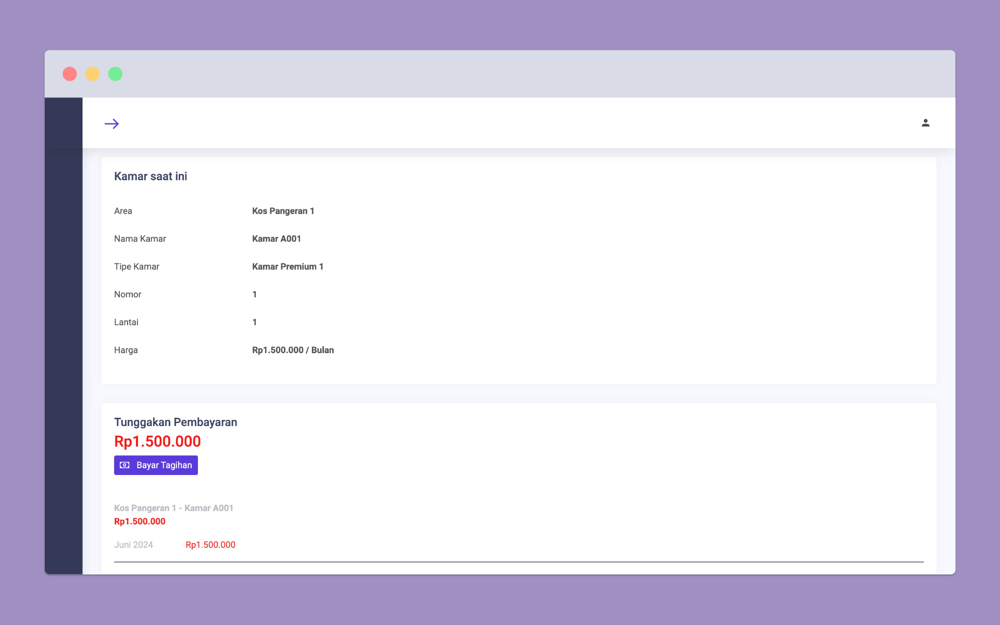
<em>Detail member room & invoice</em>

### **Manage invoice**

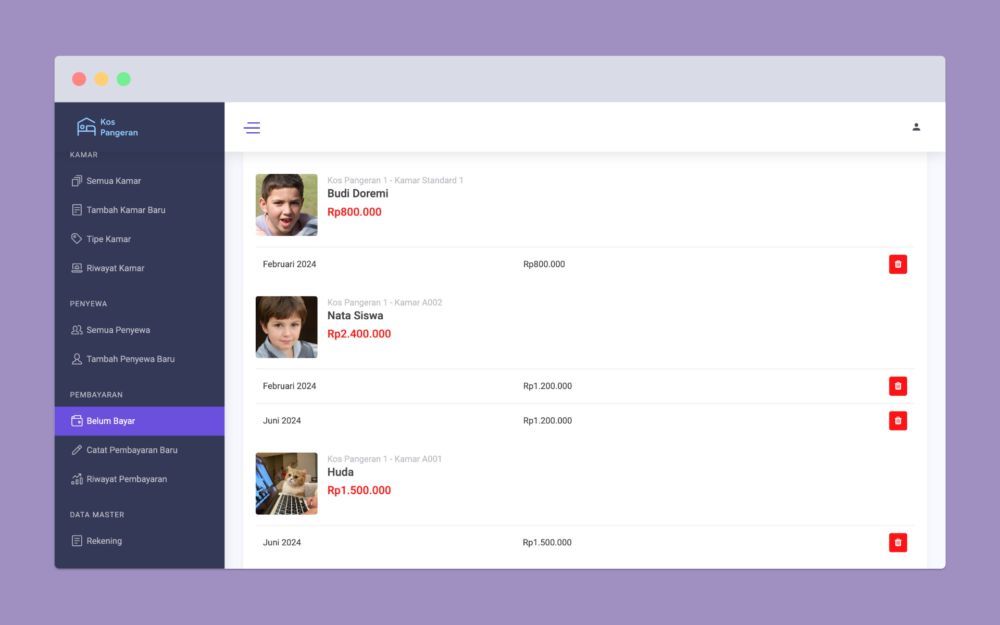
<em>List unpaid invoice</em>

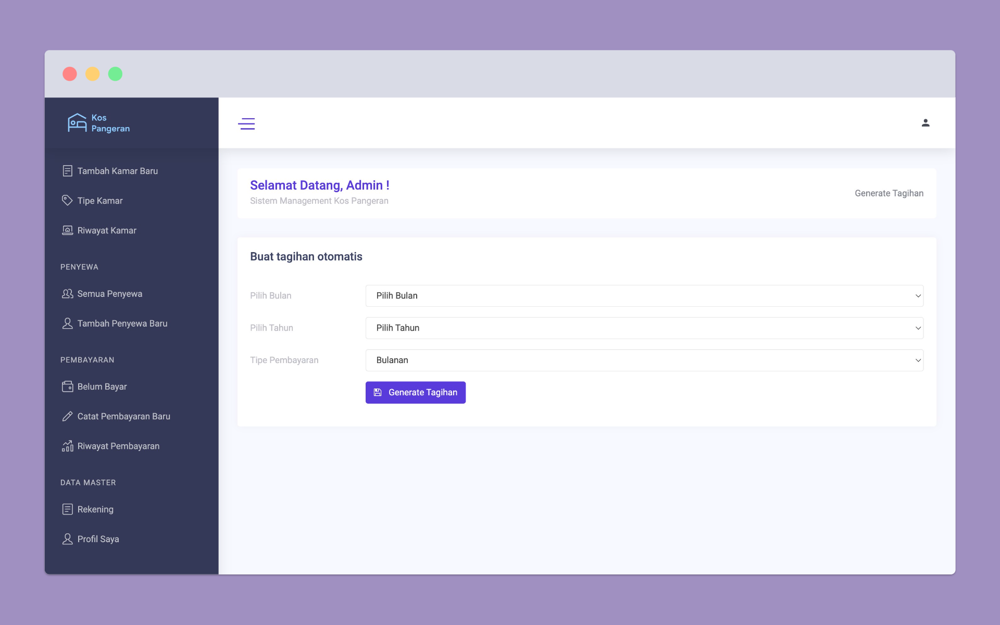
<em>Create automatic invoice based month & year</em>

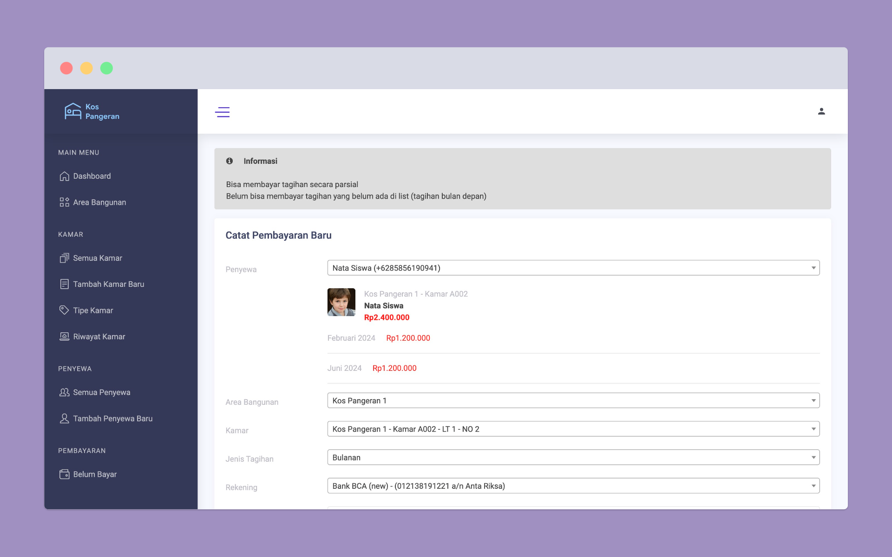
<em>Form to record payment (can be partial)</em>

**Payment history**

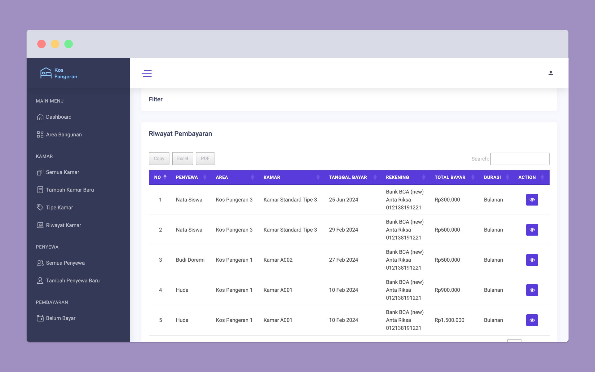
<em>List payment history (can be exported to excel & pdf)</em>

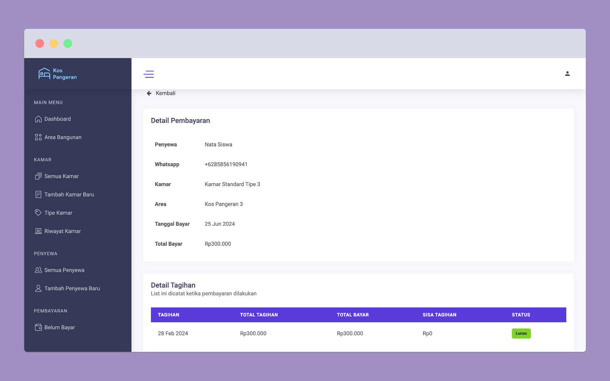
<em>Detail payment history</em>
